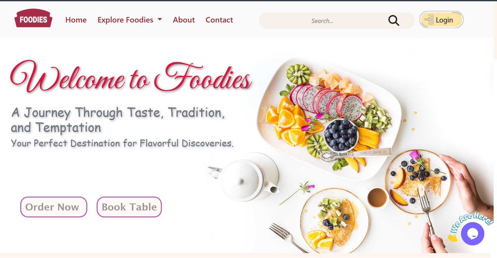

# Internship_project

# 🍽️ Foodies - Dynamic Restaurant Website

A full-featured, responsive restaurant website built using the **Python Django** framework. This project was developed as part of a two-month internship to simulate real-world restaurant management with modern web technologies.



## 🚀 Project Overview

**Foodies** is a dynamic restaurant website that allows customers to:
- Explore categorized dishes
- View detailed dish pages
- Book tables via forms
- Contact the restaurant
- Search dishes with dynamic results

Admin users can:
- Manage dishes, sections, and site content
- Upload images and text dynamically
- View form submissions (booking/contact)

## 🛠️ Tech Stack

| Technology    | Role                        |   
|---------------|-----------------------------|
| Python        | Core backend logic          |
| Django        | Web framework (MVT pattern) |
| SQLite        | Development database        |
| HTML/CSS      | Frontend structure/style    |
| Bootstrap     | Responsive UI design        |
| JavaScript    | Client-side interactivity   |

## 🧰 Features

- 🏠 Homepage with featured sections
- 🔍 Fully functional search bar
- 📜 Slug-based dynamic dish detail views (SEO-friendly)
- 📇 Admin dashboard with secure login
- 📬 Contact and table booking forms with backend storage
- 🔄 Real-time content updates via Django Admin
- 🖼️ Image and text content management
- 📱 Mobile-responsive design

## 📐 Architecture

The website follows Django’s **Model-View-Template (MVT)** architecture:

## 🎯 Objectives

- Build a user-friendly restaurant interface
- Implement dynamic and secure content management
- Provide admin capabilities without needing to touch code
- Learn and apply full-stack web development concepts

## 🧪 Results

✅ All core features implemented  
✅ Dynamic admin-controlled interface  
✅ Responsive design and smooth UI/UX  
✅ Security and form validation  
✅ Fully functional dashboard for managing content  

## 📸 Screenshots
| Page              | Preview                           | Feature         | Status             |
|-------------------|------------------------------------|------------------|---------------------|
| Homepage          |         | User Login       |          |
| Explore Dishes    |      | Search Filter    | ✅ Implemented      |
| Booking Form      |      | Booking Calendar | 🚧 In Progress      |
| Contact Form      |      | Admin Panel      | ✅ Completed        |
| Search Results    |  | Feedback Form    | ❌ Not Started      |
| Details Page      |      | Dark Mode        | ✅ Implemented      |
| Admin Dashboard   |        | Mobile Support   | ✅ Fully Responsive |


## 🏢 Internship Details

- **Company:** Elite Softwares Pvt. Ltd, Pune  
- **Intern:** Tejas Sanjay Kumbhar  
- **Duration:** Dec 2024 – Feb 2025  
- **Domain:** Full Stack Web Development  

## 💡 Future Improvements

- 💳 Online payment gateway
- 🤖 Recommendation engine
- Add to cart 

## 📜 License

This project is for academic and demonstration purposes only. Contact the author for permission before reuse.

## 📥 How to Download the Project

### 📦 Clone the Repository

```bash
-git clone https://github.com/kumbhartejas/Internship_project
or Download zip file
-cd Restaurant
-Download requirements:
    pip install django
    pip install pillow
-run following comands
     python manage.py makemigrations
     python manage.py migrate
-Create a admin id and password by running following command
     python manage.py createsuperuser
-To run the project type following command in cmd
    python manage.py runserver
-Login to admin Dashboard with the help of id and password created
-For creating more Login creadentials hit the path http://127.0.0.1:8000/admin/ and create new user


🧑‍💻 Developed with ❤️ by **Tejas Sanjay Kumbhar**


